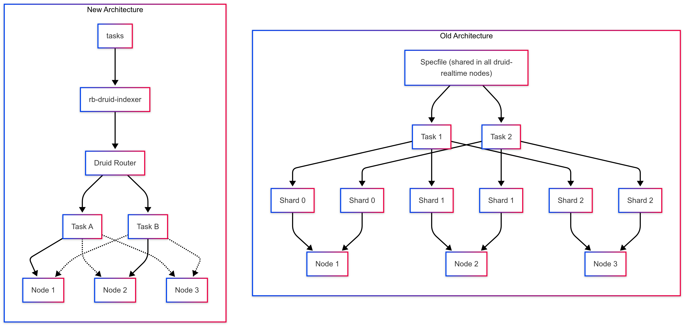

<p align="center">
    
</p>
<p align="center"><h1 align="center">RB-DRUID-INDEXER</h1></p>
<p align="center">
	<em><code>Simple distributed druid-indexer task manager for kafka ingestion </code></em>
</p>
<p align="center">
	
	
	
	
	
	
</p>
<p align="center"><!-- default option, no dependency badges. -->
</p>
<p align="center">
	<!-- default option, no dependency badges. -->
</p>
<br>

##  Table of Contents

- [ Overview](#overview)
- [ Features](#features)
- [ Configuration](#configuration)
- [ Project Structure](#project-structure)
- [ Getting Started](#getting-started)
  - [ Prerequisites](#prerequisites)
  - [ Installation](#installation)
  - [ Usage](#usage)
- [ Contributing](#contributing)
- [ License](#license)

---

##  Overview

`rb-druid-indexer` is a cluster-compatible service designed to manage the indexing of Kafka data streams into Druid. It handles task announcements, generates configuration specification files, and submits tasks to the Druid Supervisor.

---

##  How rb-druid-indexer fits in our new indexing system or yours
<p align="center">
    
</p>
In the old system, Druid indexing relied on ShardSpec with druid-realtime, where tasks were split into multiple shards across nodes for parallel processing. This approach, defined in static realtime spec files & hard-to-deploy nodes introduced complexity in shard management and scalability. In contrast, the new system uses the rb-druid-indexer, which simplifies the process by submitting single tasks without shard splitting to druid router wich automatically distribute task in druid indexer nodes and we leave overlord to manage balancing.

You can notice this fast with this diagram
<p align="center">
    
</p>


##  Features

- Multi Druid Router compatible
- Auto Finder for Druid Routers
- Cluster compatible & FailOver support using ZooKeeper 
- Automatic task managment and load balancing when submiting / deleting tasks

---

## Configuration

The configuration for `rb-druid-indexer` is defined in a YAML file and includes settings for both Zookeeper and the tasks that should be executed. Below is an example configuration file:

```yaml
zookeeper_servers:
  - "rb-malvarez1.node:2181"
  - "rb-malvarez3.node:2181"
  - "rb-malvarez2.node:2181"
discovery_path: "/druid/discovery/druid:router"

tasks:
  - task_name: "rb_monitor"
    feed: "rb_monitor"
    spec: "rb_monitor"
    kafka_brokers:
      - "rb-malvarez1.node:9092"
      - "rb-malvarez3.node:9092"
      - "rb-malvarez2.node:9092"
  - task_name: "rb_state"
    feed: "rb_state_post"
    spec: "rb_state"
    kafka_brokers:
      - "rb-malvarez1.node:9092"
      - "rb-malvarez3.node:9092"
      - "rb-malvarez2.node:9092"
  - task_name: "rb_flow"
    feed: "rb_flow_post"
    spec: "rb_flow"
    kafka_brokers:
      - "rb-malvarez1.node:9092"
      - "rb-malvarez3.node:9092"
      - "rb-malvarez2.node:9092"
  - task_name: "rb_event"
    feed: "rb_event_post"
    spec: "rb_event"
    kafka_brokers:
      - "rb-malvarez1.node:9092"
      - "rb-malvarez3.node:9092"
      - "rb-malvarez2.node:9092"
  - task_name: "rb_vault"
    feed: "rb_vault_post"
    spec: "rb_vault"
    kafka_brokers:
      - "rb-malvarez1.node:9092"
      - "rb-malvarez3.node:9092"
      - "rb-malvarez2.node:9092"
  - task_name: "rb_scanner"
    feed: "rb_scanner_post"
    spec: "rb_scanner"
    kafka_brokers:
      - "rb-malvarez1.node:9092"
      - "rb-malvarez3.node:9092"
      - "rb-malvarez2.node:9092"
  - task_name: "rb_location"
    feed: "rb_loc_post"
    spec: "rb_location"
    kafka_brokers:
      - "rb-malvarez1.node:9092"
      - "rb-malvarez3.node:9092"
      - "rb-malvarez2.node:9092"
  - task_name: "rb_wireless"
    feed: "rb_wireless"
    spec: "rb_wireless"
    kafka_brokers:
      - "rb-malvarez1.node:9092"
      - "rb-malvarez3.node:9092"
      - "rb-malvarez2.node:9092"
```


## zookeeper_servers
- **Description**: A list of Zookeeper servers used for leadership checks and coordination.
- **Type**: Array of strings.
- **Example**: 
    - `"127.0.0.1:2181"`
    - `"127.0.0.2:2181"`
## discovery_path
- **Description**: (optional field) ZooKeeper path where Druid routers are announced
- **Type**: String.
- **Example**: 
    - `"/druid/discovery/druid:router"`
## tasks
- **Description**: A list of tasks to be managed by the indexer. Each task contains the following attributes:

### task_name
- **Description**: The name of the task. This is used to identify the task in the system.
- **Type**: String.
- **Example**: 
    - `"rb_monitor"`
    - `"rb_flow"`

### spec
- **Description**: The spec file name associated with the task (for realtime configuration)
- **Type**: String.
- **Example**: 
    - `"rb_flow"`

### feed
- **Description**: The name of the Kafka feed associated with the task. This specifies which feed to listen to.
- **Type**: String.
- **Example**: 
    - `"rb_monitor"`
    - `"rb_flow_post"`

### kafka_brokers
- **Description**: The list of kafka brokers for supervisor
- **Type**: Array.
- **Example**: 
    kafka_brokers:
      - `"kafka.service:9092"`

### custom_dimensions
- **Description**: List of dimensions to append to orginal existing dimensions
- **Type**: Array of strings.
- **Example**: 
    - `"http_url"`
	- `"dst_port_as_uint64"`

Every dataSource is managed in `/druid/datasources/${datasource}.go` for example

```go
package datasources

import druidrouter "rb-druid-indexer/druid"

var FlowMetrics = []druidrouter.Metrics{
	{Type: "count", Name: "events"},
	{Type: "longSum", Name: "sum_bytes", FieldName: "bytes"},
	{Type: "longSum", Name: "sum_pkts", FieldName: "pkts"},
	{Type: "longSum", Name: "sum_rssi", FieldName: "client_rssi_num"},
	{Type: "hyperUnique", Name: "clients", FieldName: "client_mac"},
	{Type: "hyperUnique", Name: "wireless_stations", FieldName: "wireless_station"},
	{Type: "longSum", Name: "sum_dl_score", FieldName: "darklist_score"},
}

var FlowDimensionsExclusions = []string{
	"bytes", "pkts", "flow_end_reason", "first_switched", "wan_ip_name",
}

var FlowDimensions = []string{
	"application_id_name", "building", "building_uuid", "campus", "campus_uuid",
	"client_accounting_type", "client_auth_type", "client_fullname", "client_gender",
	"client_id", "client_latlong", "client_loyality", "client_mac", "client_mac_vendor",
	"client_rssi", "client_vip", "conversation", "coordinates_map", "darklist_category",
	"darklist_direction", "darklist_score_name", "darklist_score", "deployment",
	"deployment_uuid", "direction", "dot11_protocol", "dot11_status", "dst_map", "duration",
	"engine_id_name", "floor", "floor_uuid", "host", "host_l2_domain", "http_social_media",
	"http_user_agent", "https_common_name", "interface_name", "ip_as_name", "ip_country_code",
	"ip_protocol_version", "l4_proto", "lan_interface_description", "lan_interface_name",
	"lan_ip", "lan_ip_as_name", "lan_ip_country_code", "lan_ip_name",
	"lan_ip_net_name", "lan_l4_port", "lan_name", "lan_vlan", "market", "market_uuid",
	"namespace", "namespace_uuid", "organization", "organization_uuid", "product_name",
	"public_ip", "public_ip_mac", "referer", "referer_l2",
	"scatterplot", "selector_name", "sensor_ip", "sensor_name", "sensor_uuid", "service_provider",
	"service_provider_uuid", "src_map", "tcp_flags", "tos", "type", "url", "wan_interface_description",
	"wan_interface_name", "wan_ip",	"wan_ip_as_name", "wan_ip_country_code",
	"wan_ip_map", "wan_ip_net_name", "wan_l4_port", "wan_name", "wan_vlan", "wireless_id",
	"ti_category", "ti_score", "ti_policy_name", "ti_policy_id", "ti_indicators",
	"wireless_operator", "wireless_station", "zone", "zone_uuid",
}

const FlowDataSource = "rb_flow"
```

and later published in the `config.go` file in `/druid/datasources/config.go`

```go
var Configs = map[string]DataSourceConfig{
	"rb_flow": {
		DataSource: FlowDataSource,
		Metrics:    FlowMetrics,
		Dimensions: FlowDimensions,
		DimensionsExclusions: FlowDimensionsExclusions
	},
	"rb_monitor": {
		DataSource: MonitorDataSource,
		Metrics:    MonitorMetrics,
		Dimensions: MonitorDimensions,
		DimensionsExclusions: MonitorDimensionsExclusions
	},
}
```


So if you want to add your own you have to make a copy of any datasource and include in the config.go of datasource for later call it with your `config.yml`
---

##  Project Structure

```sh
rb-druid-indexer
├── LICENSE
├── Makefile
├── README.md
├── assets
│   ├── arch_img_new.png
│   ├── image.png
│   └── old_vs_new.png
├── config
│   ├── config.go
│   └── config_test.go
├── druid
│   ├── config
│   │   ├── config.go
│   │   └── config_test.go
│   ├── datasources
│   │   ├── event.go
│   │   ├── event_test.go
│   │   ├── flow.go
│   │   ├── flow_test.go
│   │   ├── location.go
│   │   ├── location_test.go
│   │   ├── monitor.go
│   │   ├── monitor_test.go
│   │   ├── scanner.go
│   │   ├── scanner_test.go
│   │   ├── state.go
│   │   ├── state_test.go
│   │   ├── vault.go
│   │   ├── vault_test.go
│   │   ├── wireless.go
│   │   └── wireless_test.go
│   ├── realtime.go
│   ├── realtime_test.go
│   ├── router.go
│   └── router_test.go
├── example_config.yml
├── go.mod
├── go.sum
├── integration
│   ├── config.yml
│   ├── docker-compose.yml
│   ├── environment
│   ├── rb_create_topics.sh
│   ├── rb_generate_compose.sh
│   ├── rb_produce_syn_data.sh
│   └── rb_run_integration_tests.sh
├── logger
│   ├── logger.go
│   └── logger_test.go
├── main.go
├── main_test.go
├── packaging
│   └── rpm
│       ├── Makefile
│       ├── rb-druid-indexer.service
│       └── rb-druid-indexer.spec
├── rb-druid-indexer
└── zkclient
    ├── client.go
    ├── client_test.go
    ├── election.go
    ├── election_test.go
    ├── task_announcer.go
    └── task_announcer_test.go
```

---
##  Getting Started

###  Prerequisites

Before getting started with rb-druid-indexer, ensure your runtime environment meets the following requirements:

- **Programming Language:** Go
- **Package Manager:** Go modules


###  Installation

Install rb-druid-indexer using one of the following methods:

**Build from source:**

1. Clone the rb-druid-indexer repository:
```sh
❯ git clone https://github.com/redBorder/rb-druid-indexer
```

2. Navigate to the project directory:
```sh
❯ cd rb-druid-indexer
```

3. Install the project dependencies:


**Using `go modules`** &nbsp; [](https://golang.org/)

```sh
❯ go build
```

###  Usage
Run rb-druid-indexer using the following command:
**Using `go modules`** &nbsp; [](https://golang.org/)

```sh
❯ ./rb-druid-indexer --config example_config.yml
```


---

##  Contributing

- **💬 [Join the Discussions](https://github.com/redBorder/rb-druid-indexer/discussions)**: Share your insights, provide feedback, or ask questions.
- **🐛 [Report Issues](https://github.com/redBorder/rb-druid-indexer/issues)**: Submit bugs found or log feature requests for the `rb-druid-indexer` project.
- **💡 [Submit Pull Requests](https://github.com/redBorder/rb-druid-indexer/blob/main/CONTRIBUTING.md)**: Review open PRs, and submit your own PRs.

<details closed>
<summary>Contributing Guidelines</summary>

1. **Fork the Repository**: Start by forking the project repository to your github account.
2. **Clone Locally**: Clone the forked repository to your local machine using a git client.
   ```sh
   git clone https://github.com/redBorder/rb-druid-indexer
   ```
3. **Create a New Branch**: Always work on a new branch, giving it a descriptive name.
   ```sh
   git checkout -b new-feature-x
   ```
4. **Make Your Changes**: Develop and test your changes locally.
5. **Commit Your Changes**: Commit with a clear message describing your updates.
   ```sh
   git commit -m 'Implemented new feature x.'
   ```
6. **Push to github**: Push the changes to your forked repository.
   ```sh
   git push origin new-feature-x
   ```
7. **Submit a Pull Request**: Create a PR against the original project repository. Clearly describe the changes and their motivations.
8. **Review**: Once your PR is reviewed and approved, it will be merged into the main branch. Congratulations on your contribution!
</details>

<details closed>
<summary>Contributor Graph</summary>
<br>
<p align="left">
   <a href="https://github.com{/redBorder/rb-druid-indexer/}graphs/contributors">
      
   </a>
</p>
</details>

---

##  License

This project is protected under the [AGPL-3.0](https://www.gnu.org/licenses/agpl-3.0.txt) License. For more details, refer to the [LICENSE](https://www.gnu.org/licenses/agpl-3.0.txt) file.

---

##  Author

This project is developed for redBorder and the OS community by Miguel Álvarez <malvarez@redborder.com>

---
